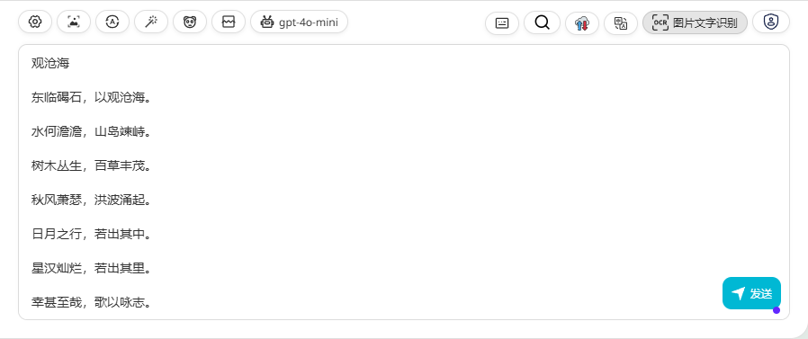
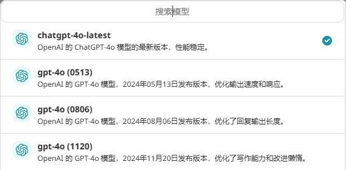

# ChatGPT Next Web 二创
> 原项目：[ChatGPTNextWeb](https://github.com/ChatGPTNextWeb/ChatGPT-Next-Web)


**分歧节点：2.12.3，侧重维护 OpenAI 类型渠道**

##  二开新增特性
- 模型选择器优化
- 快速搜索聊天记录
- 可自定义**侧边栏**，支持 html 样式
- 免导入导出的云备份功能（需配合[文件服务器项目](https://github.com/QAbot-zh/go-file-server)使用）
- OpenAI 类型支持前端配置，一键拉取可用模型


- 基于 AI 模型的中英互译


- 基于 AI 模型的 OCR 




- 基于正则匹配的隐私打码（**所有基于 AI 模型的功能的信息安全请自行把握，包括上述的翻译和ocr，打码功能不基于 AI 实现**）


## 环境变量

> [简体中文 > 如何配置 api key、访问密码、接口代理](./README_CN.md#环境变量)

### `CODE` (optional)

Access password, separated by comma. （授权码，支持英文逗号分隔多个code）

### `OPENAI_API_KEY` (required)

Your openai api key, join multiple api keys with comma. （openai 密钥，支持英文逗号分隔多个key）

### `BASE_URL` (optional)

> Default: `https://api.openai.com`

> Examples: `http://your-openai-proxy.com`

Override openai api request base url. （openai 渠道自定义接口地址）

### `OPENAI_ORG_ID` (optional)

Specify OpenAI organization ID. （openai 组织 ID）

### `HIDE_USER_API_KEY` (optional)

> Default: Empty

If you do not want users to input their own API key, set this value to 1. （要禁止前端使用用户的key，则设置该变量非空）

### `DISABLE_GPT4` (optional)

> Default: Empty

If you do not want users to use GPT-4, set this value to 1. （要禁止用户使用 gpt4/chatgpt-4o/o1 等 gpt 高级模型，则设置该变量非空）

### `ENABLE_BALANCE_QUERY` (optional)

> Default: Empty

If you do want users to query balance, set this value to 1. （要禁止用户查询api余额，则设置该变量非空）

### `DISABLE_FAST_LINK` (optional)

> Default: Empty

If you want to disable parse settings from url, set this to 1. （要禁止url解析参数，则设置该变量非空）

### `CUSTOM_MODELS` (optional)

> Default: Empty
> Example: `+llama,+claude-2,-gpt-3.5-turbo,gpt-4-1106-preview=gpt-4-turbo` means add `llama, claude-2` to model list, and remove `gpt-3.5-turbo` from list, and display `gpt-4-1106-preview` as `gpt-4-turbo`.

To control custom models, use `+` to add a custom model, use `-` to hide a model, use `name=displayName<description>` to customize model name, separated by comma.

User `-*provider` to disable specified models, `+*provider` to enable specified models. 

User `-all` to disable all default models, `+all` to enable all default models. （自定义模型参数）

 **支持通过<>设置模型描述**

 示例：



### `SIDEBAR_TITLE` (optional)

Set the title of sidebar. （侧边栏标题）

### `SIDEBAR_SUBTITLE` (optional)

Set the subtitle of sidebar. Support html parsing. （侧边栏子标题，支持html解析）

- html 示例：
```
<br>
<div style="line-height: 1.8;">
   <div>AI-Chat 演示站</div>
   <div>测试侧边栏文字 HTML 解析</div>
   <a href="https://github.com/QAbot-zh/ChatGPT-Next-Web" 
      style="color: #1890ff;
               text-decoration: none;
               font-weight: 500;
               transition: all 0.3s ease;
               padding: 2px 4px;
               border-radius: 4px;
               background-color: rgba(24,144,255,0.1);">
      <span style="margin-bottom: 8px;">📦</span>Github项目
   </a>
</div>
```

实际效果：


### `SITE_TITLE` (optional)

Set the website title. （网站顶部标题）

### `COMPRESS_MODEL` （optional）

Set the title generation and history compression model. （设置标题生成、历史压缩模型，默认为 gpt-4o-mini）

### `TRANSLATE_MODEL` （optional）

Set the translate model. （设置翻译模型，默认为 gpt-4o-mini）

### `OCR_MODEL` （optional）

Set the ocr model. （设置 ocr 模型，默认为 gpt-4o-mini）


### `WHITE_WEBDEV_ENDPOINTS` (optional)

You can use this option if you want to increase the number of webdav service addresses you are allowed to access, as required by the format：
- Each address must be a complete endpoint 
> `https://xxxx/yyy`
- Multiple addresses are connected by ', '

### `DEFAULT_INPUT_TEMPLATE` (optional)

Customize the default template used to initialize the User Input Preprocessing configuration item in Settings.


## LICENSE

[MIT](https://opensource.org/license/mit/)